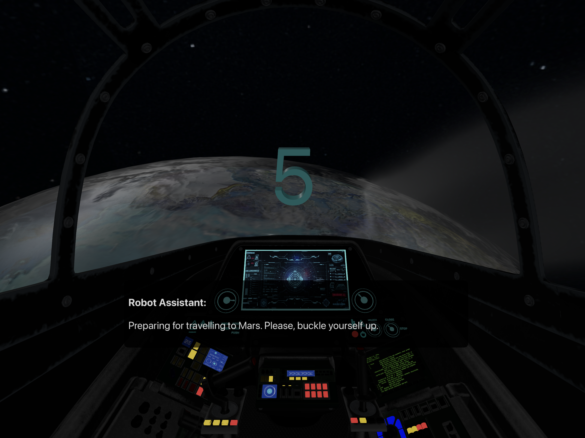
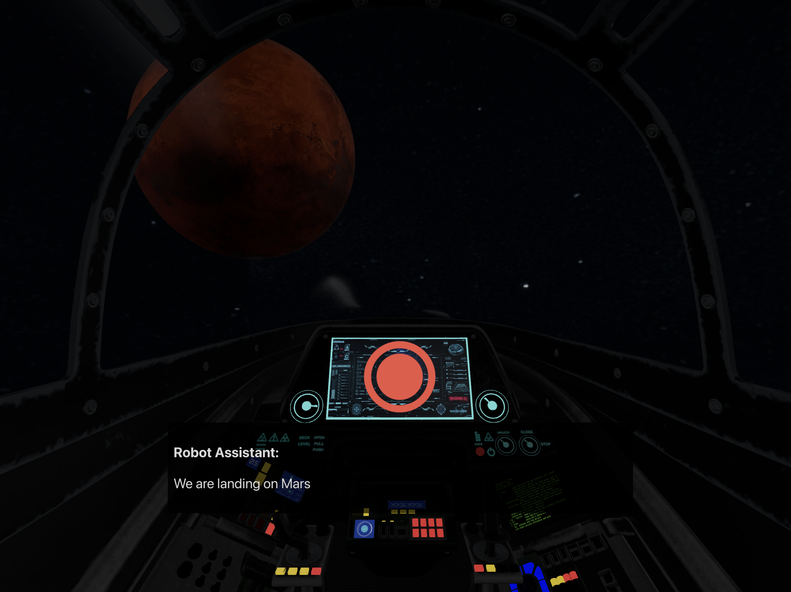
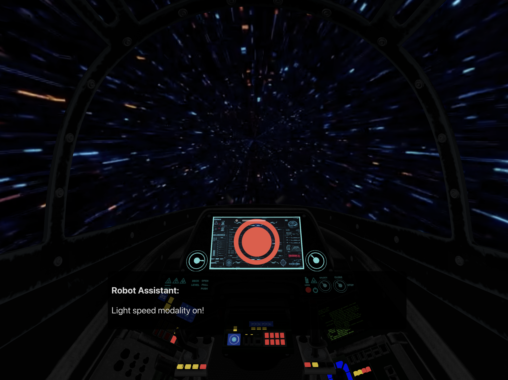
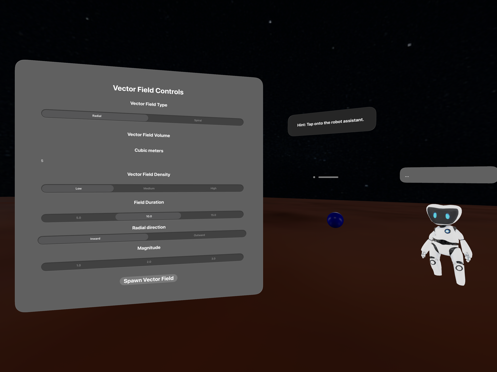
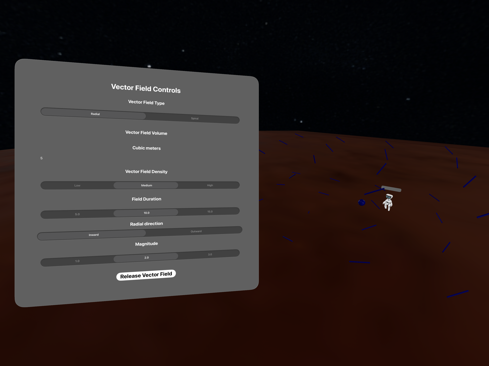

# Space Patrol

## Why is **Space Patrol** Useful?

**Space Patrol** is a fictional adventure set within a futuristic mission to Mars. It follows the journey of a patrol inspector guided by a small robotic assistant—serving as both a narrative companion and functional guide throughout the immersive experience. But beyond the story, **Space Patrol** is a deeply personal exploration of creative and technical experimentation on the Apple Vision Pro platform.

**Space Patrol** embeds:

- **Interactive Narrative as a Learning Interface**  
  The core journey of traveling to Mars is more than a sci-fi tale—it’s designed as a dynamic learning experience. By embedding users in a story-driven mission and integrating real-time user interaction, it becomes an accessible gateway to learning concepts related to space, motion, and spatial reasoning.

- **Human-Robot Interaction in Immersive Space**  
  A small robot assistant guides the user, creating a unique form of user onboarding and contextual assistance. This character serves as an entry point to augmented interfaces and immersive logic flows—offering a clear model for how to create guided experiences in spatial computing environments.

- **Interface to a Deeper Framework: FieldKit**  
  One of the key motivations behind this project is its role as an experimental frontend for a much deeper effort—**FieldKit**, a custom framework I’m actively building. FieldKit is meant to empower visionOS developers with tools for working with **vector fields** and mathematical visualization in 3D space. The immersive nature of Vision Pro makes it ideal for abstract math visualization, and **Space Patrol** serves as the first conceptual playground for this framework.

- **Personal Exploration of Space, Math & Geometry**  
  Space Patrol isn’t just a tech demo—it’s a manifestation of my passion for space, geometry, and mathematics, all within an immersive 3D setting. The project lets me merge creative storytelling with technical problem-solving, using immersive media to engage deeply with scientific ideas.

---

## Technologies Behind **Space Patrol**

**Space Patrol** is built using a variety of advanced technologies and architectural patterns native to visionOS and iOS. While still in an early stage of development, its technical underpinnings lay the groundwork for scalable and performant immersive experiences. Here’s how:

- **RealityKit for 3D Scene Construction and Spatial Logic**  
  I used **RealityKit** to handle spatial content, such as importing and manipulating 3D models. It helped with complex operations like matrix transforms and compositions—particularly for animating planetary systems or placing SwiftUI elements within immersive scenes. It provided the necessary control over coordinate space and transformation logic, making it ideal for spatial simulations.

  
  

- **Reality Composer Pro for Shader Graphs and Visual Effects**  
  The use of **Reality Composer Pro** allowed me to build both **geometry** and **surface shaders** through node-based visual programming. For example:
  - The **moon orbiting Earth** effect in the second view was implemented using a **geometry shader material**, where the vertex positions were dynamically altered to simulate orbit.
  - The **sun** was rendered with a **surface shader** to give it a molten, lava-like glow—something that would traditionally require custom-written vertex and fragment shaders in a lower-level GPU pipeline.
  
  Reality Composer Pro acted as an abstraction layer over more complex GPU shader languages, helping accelerate the iteration process while still offering a powerful shader toolkit.

- **Combine for Asynchronous Event Handling and UI Bridging**  
  I used **Combine** to manage **asynchronous data streams**, allowing me to synchronize changes between SwiftUI and UIKit components without falling back to traditional delegate patterns. Combine helped structure the app in a more reactive way, enabling the robot assistant and other parts of the experience to respond to user inputs and system events smoothly and declaratively.

  

- **Entity-Component-System Pattern via FieldKit (Work in Progress)**  
  The underlying framework I’m developing, **FieldKit**, is being architected with the **Entity-Component-System (ECS)** design pattern—commonly used in high-performance game engines. This pattern allows for clean, modular, and reusable logic when managing simulations like vector field dynamics. While the bridging layer between FieldKit and the UI is still under development, the structure is already capable of expressing complex mathematical systems in a composable and flexible way.

- **Prototyping the Future of Math Visualization in visionOS**  
  Through Space Patrol, I’ve begun testing ideas for how **immersive devices can serve as educational instruments for math and physics**—particularly in visualizing vector fields, space-time interactions, and geometric relationships. The project is a proving ground for both UX patterns in spatial computing and deeper rendering logic that will eventually be handled by FieldKit.

  
  

---

## 📄 License

**Space Patrol** is released under the [MIT License](https://opensource.org/licenses/MIT).  
This means you're free to use, modify, and distribute the project for personal or commercial purposes, provided that the original license and copyright notice are included.
